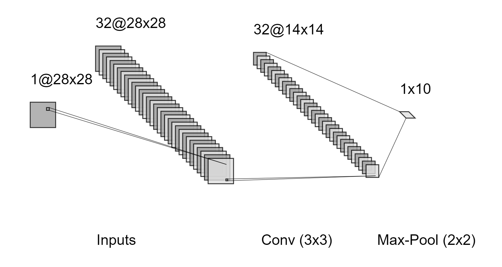

# Objective
This project intends to compare the performance of an image classification task on [Fashion-MNIST dataset](https://github.com/zalandoresearch/fashion-mnist) among different simple CNNs, a RNN, and an LSTM.
## CNN models

### Conv-MaxPool

    

  
  ### Strided-Conv

   

  
### Small-Conv

  

<!-- 
### Stride-Conv

### Small-Conv

# Meaurement results
## CNN -->

## Sequence Mdoel
RNN is known for processing sequential data with time, but it can also be applied on image datasets. We input one row of the image into the model at every time step from top to bottom, as if the model learns to predict by reading the image one row after another. Since the resolution of images in the Fashion Mnist dataset is 28 by 28, the input dimension for each time step is(1x28), and the sequence length is also 28. Then the hidden state of the final time step gets passed to a fully connected network to make the final prediction.

The general model structure of both RNN and LSTM are shown below:

 

# Result

#### Test Set

| Model        | Accuracy    | Precision     | F1 Score      | Recall       |
|   :----:    |    :----:   |     :----:    |   :----:       |  :----:       |
| Conv-MaxPool | 90.57%      | 90.56%        | 90.51%        | 90.57%       |
| Stride-Conv | 90.67%      | 90.64%        | 90.61%        | 90.67%       |
| **Drop-Norm-L2**  | **91.14%**      | **91.16%**        | **91.13%**        | **91.14%**       |

#### Vallidation Set
| Model       | Accuracy    |
|   :----:    |    :----:   |
| Conv-MaxPool | 91.20%      |
| Stride-Conv | 91.38%      |
| Drop-Norm-L2  | 92.83%      |

#### Training Set
| Model       | Accuracy    |
|   :----:    |    :----:   |
| Conv-MaxPool | 94.94%      |
| Stride-Conv | 94.56%      |
| Small-Conv  | 98.10%      |

#### Stride-Conv Heatmap on Test dataset

## Sequence model
K fold validation is performed on the dataset using Both RNN and LSTM. In the experiment, RNN generally started to overfit after epoch 10, with validation accuracies vascilating at around 83%-84%, whereas LSTM tended to overfit after epoch 6 with around 89% validation accuracy. We found that for our task specifically, LSTM outperformed RNN by a large margin, and also converged faster. The best validation accuracy achieved by our LSTM reached 90.55%, which is comparible to the majority of our simple CNN models.
### Average validation accuracy obtained from 5-fold validation

|    RNN    |  LSTM     | 
|   :----:    |    :----:   |  
|   82.52%  | 89.93%    |

### Accuracy on both training and validation set over time

### Presentation

For more details, please also check our [powerpoint](./Image_Classification.pptx).
