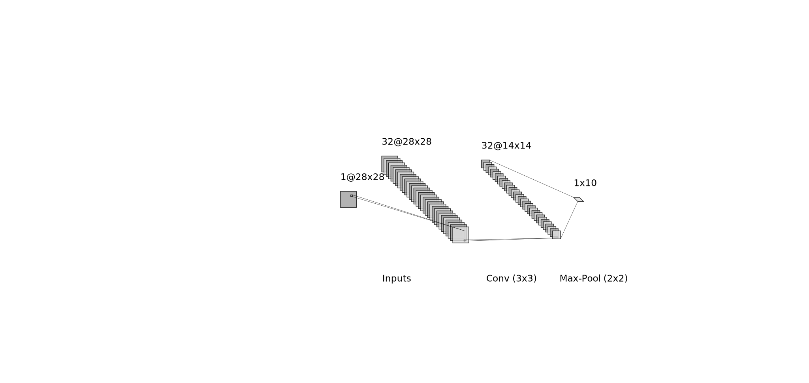

# Homework 2, JUL/8/2021

## Deadline: 10:30 PM, JUL/13/2021, TUE (BJT)

## Requirements
1. Implement a CNN, RNN in Python.
2. Apply the algorithms to real world problems of your choice.
3. Compare their efficiency and accuracy.
4. Prepare a ppt presentation of your resuilts.

## Tasks
- [x] Read the README file
- [x] Write CNN classifier using pytorch
- [x] Write RNN classifier using pytorch
- [x] Prepare the Fashion MNIST training set for CNN
- [x] Prepare the Fashion MNIST training set for RNN
- [x] Fine-tuning the CNN on training set (cross validation)
- [ ] Fine-tuning the RNN on training set (cross validation)
- [x] Measure CNN performance on test set
    - [x] Accuracy, precision, and recall
    - [x] F scores
    - [x] Confusion matrix in heatmap
    - [x] Overfitting
- [ ] Measure RNN performance on test set
    - [ ] Accuracy, precision, and recall
    - [ ] F scores
    - [ ] Confusion matrix in heatmap
    - [ ] Overfitting
- [ ] Make slides, prepare presentation

## Models
### Conv-MaxPool

### Stride-Conv

### Small-Conv

## Meaurement results
### CNN

#### Test Set
| Model       | Accuracy    | Precision     | F1 Score      | Recall       |
|   :----:    |    :----:   |     :----:    |   :---:       |  :---:       |
| Conv-MaxPool | 90.57%      | 90.56%        | 90.51%        | 90.57%       |
| Stride-Conv | 90.67%      | 90.64%        | 90.61%        | 90.67%       |
| **Drop-Norm-L2**  | **91.14%**      | **91.16%**        | **91.13%**        | **91.14%**       |

#### Vallidation Set
| Model       | Accuracy    |
|   :----:    |    :----:   |
| Conv-MaxPool | 91.20%      |
| Stride-Conv | 91.38%      |
| Drop-Norm-L2  | 92.83%      |

#### Training Set
| Model       | Accuracy    |
|   :----:    |    :----:   |
| Conv-MaxPool | 94.94%      |
| Stride-Conv | 94.56%      |
| Small-Conv  | 98.10%      |
poweauifhjwiafujhawiofcjsdoaikfjvreiughwe;afoicjsdoiavjnda;oiwejfuoirwehgvsakljdcaw;oifhwoighawefwagwaef
wafuijhawiufnwilsaufhweoafuhiweao;ljfhncuskdjafhcnweiuafhaowe
#### Stride-Conv Heatmap on Test dataset

