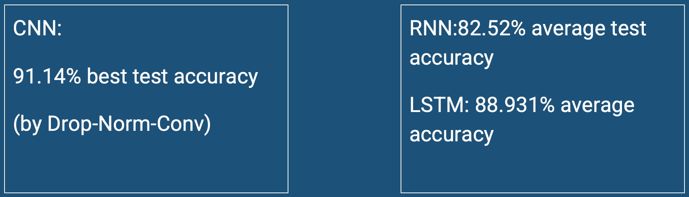
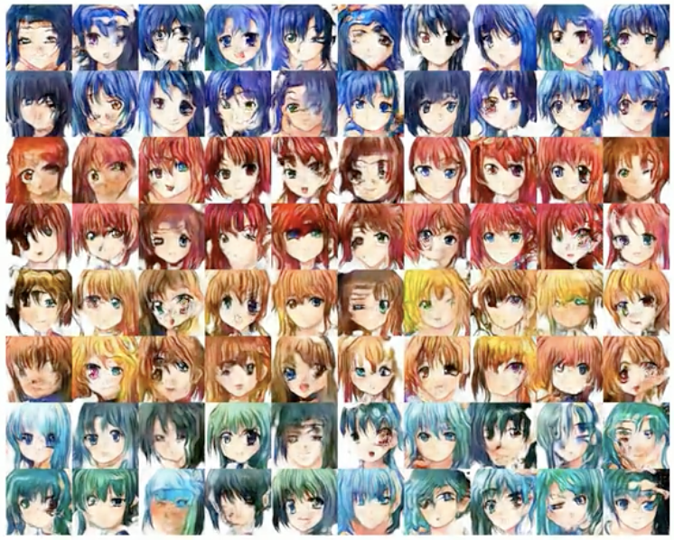

# Machine Learning Projects

Hi! Here is the code repository of our online research seminar supervised by [Prof. Mark Vogelsberger](https://physics.mit.edu/faculty/mark-vogelsberger/). We are a team of 4 members, Javin Liu, Tuofu Li, Yintao Tai, and Yuxuan Tian (sorted alphabetically by last name). During this seminar, we attended a Deep Learning course which is given by Prof. Mark Vogelsberger, and conducted 4 experiments. 

## Image Classfication

We constructed CNN and RNN based nets and analyzed their performance on image classification tasks. We also compared the performance of different normalization/regularization methods including **batch normalization**, **dropout**, and **L2 regularisation**; different CNN downsampling methods including **stride** and **pooling**; different RNN structures including **LSTM**. You can find details [here](CNN_Squence_Classification/README.md).

## Image Synthesis with GANs

In this experiment, we implemented several CNN-based GANs, including **unconditional** GAN and **conditional** GAN to synthesis new images from Fashion MNIST and the [Anime Face dataset](https://www.kaggle.com/splcher/animefacedataset). Because the Anime Face dataset is not classfied, we clustered the original images using K-Means according to the hair colors. Details are demonstrated [here](GAN/GAN/README.md).

## Sentence Classfication with GRUs

We implemented and compared the **LSTM** and **GRU** performance on several classfication tasks. For Corona-tweets and IMDB datset the task is **Sentiment Classfication**. We used a learnable embedding layer to embed the tokenized tokens. For MNIST and FASHION-MNIST dataset the task is **Image Classfication**. You can find more details [here](LSTM%20&%20GRU/GRU%20&%20LSTM.pptx)

## Brain Tumor Segmentation with Attention-based U-Nets

This is our final project, you can find details [here](https://github.com/TYTTYTTYT/Attention_Based_U-Nets).